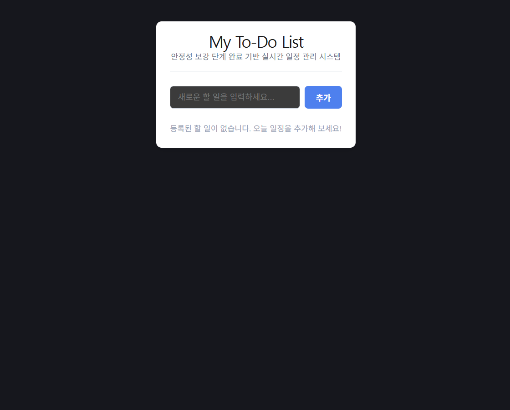

# 🚀 Full-Stack MERN To-Do Application

React, Express, MongoDB를 활용하여 설계된 유기적 아키텍처 기반의 실시간 할 일 관리(To-Do) 웹 애플리케이션입니다. 

웹 개발의 핵심인 **CRUD(Create, Read, Update, Delete)** 흐름을 명확히 구현하고, 관심사 분리(SoC) 원칙에 입각하여 레이어별 모듈화를 진행한 프로젝트입니다.

---

## 🖼 1. Project 실행 화면 (Main Dashboard)

프로젝트가 정상적으로 연동되어 실행 중인 메인 대시보드 화면입니다. 모던한 UI와 비동기 데이터 통신 상태를 한눈에 확인할 수 있습니다.



*(그림 1. My To-Do List 애플리케이션 가동 화면)*

---

## 🛠 2. Tech Stack (기술 스택)

| 레이어 | 기술 스택 | 상세 역할 |
| :--- | :--- | :--- |
| **Frontend** | React, Vite, HTML5/CSS3 | 컴포넌트 중심 UI 설계, 상태 관리 및 비동기 Fetch 통신 |
| **Backend** | Node.js, Express | RESTful API 라우팅 처리 및 비즈니스 로직 제어 |
| **Database** | MongoDB, Mongoose | NoSQL 문서 지향 데이터 모델링 및 데이터 영구 저장 |

---

## 📂 3. Project Architecture (디렉토리 구조)

유지보수성과 확장성을 극대화하기 위해 클라이언트와 서버를 분리하고, 백엔드는 역할에 따라 가독성 높게 레이어를 구분했습니다.

```text
todo-project/
├── backend/                  # 백엔드 (Express + MongoDB)
│   ├── config/               # 환경 설정 및 DB 커넥션 관리 (db.js)
│   ├── controllers/          # 비즈니스 CRUD 로직 처리 (todoController.js)
│   ├── models/               # 데이터베이스 스키마 명세 (Todo.js)
│   ├── routes/               # API 엔드포인트 라우팅 분리 (todoRoutes.js)
│   ├── .env                  # 환경변수 관리 파이프라인
│   └── server.js             # 백엔드 Entry Point (서버 진입점)
├── frontend/                 # 프론트엔드 (React + Vite)
│   └── src/
│       ├── components/       # 단위 기능별 재사용 컴포넌트 (Input, List, Item)
│       ├── App.css           # 모던 UI 스타일시트
│       └── App.jsx           # 비동기 데이터 동기화 및 메인 허브 컴포넌트
└── image/
    └── image.png             # 애플리케이션 실행 화면 자산
🔄 4. System Data Flow (시스템 데이터 흐름도)
웹 애플리케이션의 핵심 라이프사이클을 담당하는 4대 CRUD 트랜잭션의 상세 흐름 메커니즘입니다.

✨ Create (POST)
사용자가 UI 창에 새로운 할 일을 입력합니다.

TodoInput 컴포넌트에서 부모 컴포넌트의 상태 변경 핸들러를 호출합니다.

비동기 fetch(POST) 네트워크 요청이 서버로 발송됩니다.

Express 서버의 JSON 미들웨어가 데이터를 파싱한 뒤, Mongoose 모델을 통해 MongoDB 클라우드 저장소에 영구 저장합니다.

생성 완료된 다큐먼트 데이터를 반환받으면 프론트엔드가 상태 객체의 불변성을 유지하며 리렌더링을 트리거합니다.

✨ Read (GET)
컴포넌트가 마운트되는 시점에 useEffect 훅이 가동됩니다.

백엔드 API 서버로 비동기 fetch(GET) 요청을 전송합니다.

컨트롤러 레이어에서 데이터베이스 자료를 최신순(createdAt: -1)으로 정렬하여 JSON 배열로 반환하며, 화면 리스트에 표출됩니다.

✨ Update (PUT)
사용자가 체크박스를 토글하면 고유 식별자(_id)가 라우터 파라미터로 전송됩니다.

Mongoose의 findByIdAndUpdate 쿼리 알고리즘을 수행하여 데이터베이스 상태 데이터 값의 논리 반전을 적용합니다.

✨ Delete (DELETE)
사용자가 삭제 액션을 발생시키면 안전성 컨펌 가드를 호출합니다.

확인 승인 시 fetch(DELETE) API가 요청되며 데이터베이스 자원이 영구 소멸됩니다.

프론트엔드는 자바스크립트의 고차 함수인 filter 연산을 수행하여 원본 배열 훼손 없이 화면을 실시간 동기화합니다.

⚡ 5. 예외 처리 및 안정성 방어 포인트
유효성 검증 (Validation)

클라이언트 단에서 공백 문자 입력 및 의미 없는 무의미 문자열 진입을 차단하는 가드 처리를 구현했습니다.

MongoDB 스키마 내부에 required 명세를 선언하여 인프라 레이어의 데이터 무결성을 이중으로 확보했습니다.

사용자 경험 (UX) 제어

원격 분산 네트워크 통신의 지연 현상에 대응하기 위해 isLoading 상태 플래그를 제어합니다.

데이터 적재 전까지 로딩 스피너 UI를 조건부로 노출하여 매끄러운 흐름을 보장합니다.

안전장치 설계 (Safe Guard)

데이터 유실 위험을 수반하는 파괴적인 삭제 제어 액션이 인입될 경우, 브라우저 내장 대화상자 컴포넌트를 추가하여 의도치 않은 데이터 손실을 원천 예방했습니다.

🔒 6. Security Policy (보안 정책)
본 프로젝트는 안전한 자격 증명 관리 정책에 입각하여, 데이터베이스 계정 정보(ID/PW)를 소스코드 및 커밋 로그에 절대 하드코딩하지 않습니다. 민감 정보 누출을 방지하기 위해 환경변수 분리 파이프라인(dotenv) 아키텍처를 도입하여 격리 관리합니다.

🛠 로컬 구동 시 환경변수 설정 방법
backend 루트 디렉토리에 .env 파일을 생성합니다.

아래 규격에 맞춰 클라우드 DB 연결 문자열(Connection String)과 포트를 인젝션합니다.

.gitignore에 .env를 명시하여 원격 저장소(GitHub)로의 유출을 원천 차단합니다.

코드 스니펫
PORT=5000
MONGODB_URI=mongodb+srv://<username>:<password>@cluster0.mzxzzpf.mongodb.net/todoDB?retryWrites=true&w=majority&appName=Cluster0
💻 7. Installation & Running (구동 방법)
프로젝트를 로컬 환경에서 구동하기 위한 정석적인 절차입니다.

1. Prerequisites (사전 준비)
Node.js 설치: v18 이상의 최신 안정화 버전(LTS) 환경을 권장합니다.

Database 자산 구비: MongoDB Atlas 원격 클러스터 인스턴스 정보 또는 로컬 몽고디비 URI 커넥션 스트링을 사전에 준비합니다.

2. 프로젝트 클론 (Clone)
Bash
git clone <GitHub 저장소 주소>
cd todo-project
3. Backend Setup & Run
백엔드 루트 디렉토리로 진입하여 패키지 종속성을 설정하고, Security Policy 섹션을 참고하여 .env 파일을 구성한 뒤 가동합니다.

Bash
cd backend
npm install
npm run dev
4. Frontend Setup & Run
클라이언트 독립 인스턴스를 설치하고 로컬 개발 서버를 실행합니다.

Bash
cd frontend
npm install
npm run dev